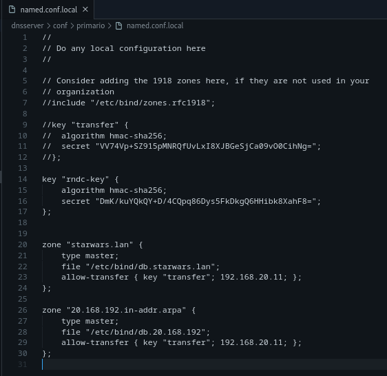

# 1.6 logs + utilidade rndc + nsupdate

1. Fai que no equipo darthvader se faga un log de todas as consultas (/var/log/bind/queries.log) e de todas as actualizacions (/var/log/bind/update.log) a dous ficheiros de log diferentes. Captura a configuración. Amosa as capturas dos dous ficheiros de log, despois de facer consultas e actualizacións e transferencias de zona.

- named.conf.options de darthvader:

- Creación dos ficheiros de log:

- Comprobación:
    - "/var/log/bind/queries.log":

    

    - "/var/log/bind/update.log":

        

2. Investiga como co comando "dig" podes pedir unha copia dunha zona.

3. Permite que o equipo darthvader poida ser controlado coa utilidade rndc desde un cliente ubuntu ou debian. Fai unha captura do servidor reiniciandose.

- Añadimos estas líñas de configuración en named.conf.options en darthvader:

- Creamos a chave rndc no servidor co comando:
rndc-confgen -a

- named.conf.local en darthvader:

- rndc.conf en leia (/etc/rndc.key):

- En darthvader reiniciamos o named

- Comprobamos desde o cliente (Leia) co comando:
rndc status

4. Instala unha zona dinámica no servidor darthvader chamada galaxia.lan e introduce os rexistros aaylasecura (192.168.20.239) e yarua (192.168.20.238). Esta zona debe ser cargada mediante rndc, e o servidor reiniciado con rndc. Proba tamén a eliminala con rndc. Inclue capturas do resultado dos comandos, comprobando tamén que se poden facer consultas.

- Añadimos a zona no named.conf.local do darthvader:

- Creamos a zona bd.galaxia.lan:

- Cargamos a zona galaxia.lan con rndc co comando:
rndc reload galaxia.lan

- Reiniciamos o servidor con rndc co comando:
rndc restart

- Eliminamos a zona galaxia.lan con rndc co comando:
rndc delzone galaxia.lan

5. Mediante a utilidade nsupdate, engade un rexistro chamado darthmaul (192.168.20.144) á zona starwars.lan empregando chaves

